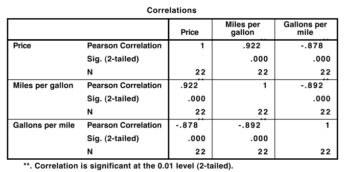
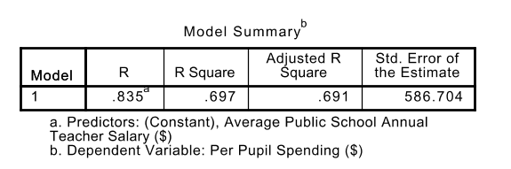
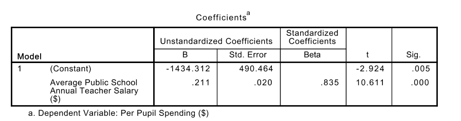
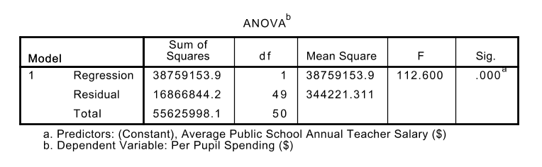

```{r setup, include=FALSE}
knitr::opts_chunk$set(echo = TRUE)
```

## Abstract


This lab returns to the ADHD data and explores a relationship between
ADHD symptoms (`hyper` and `inatt`) and measures of anxiety (`GADD`, `genaxa`)
and panic (`PAG` and `paa`) noticed by Prevatt et al (2015). At the end of
this lab you should be able to perform a simple linear regression,
including diagnostics and prediction. The scientific questions
addressed by these data are "Can the impulsivity symptoms be used to
predict general anxiety in ADHD patients?"

## 1. ADHD and College Performance

Prevatt, Dehili, Taylor and Marshall (2015) were interested in how the
symptoms of attention deficit hyperactivity disorder (ADHD) affect the
performance of college students. To study this, they looked at the
relationship of the two key symptoms of ADHD, inattention and
impulsivity, on measures of both academic and general anxiety and
panic.  In other words, they were looking for a correlation between
the symptom variables and the measures of academic anxiety. In this
case, we are going to examine the relationship between ADHD symptoms
and the anxiety measures. The primary questions in this lab are:

* Is it useful to use linear regression to predict the anxiety (or panic)
  score from the ADHD symptom scores? What is the prediction line? How
  much of the variance in the anxiety and panic scores can be predicted
  by the ADHD Symptoms?

To do this, we will perform a series of regressions.  The $X$
variables will be chosen from the ADHD scores, `hyper`, `inatt` and
the sum of `hyper` and `inatt` (which you made in Part 2).  For the
$Y$ axis, you can choose any of the four varables:

* `GADD` -- General Anxiety
* `genaxa` -- General Academic Anixiet
* `PAG` -- General Panic attacks.
* `paa` -- Panic Attacks Academic.

(Note that although I'm using the SPSS variable names so that you know
which variables I'm referencing, your audience will not know these
names, so you will need to explain them.  It is normally better to
spell them out, unless the abbreviation is used a lot).

Note also that you only need to pick one of the four choice for $Y$
variable; your choice.

* Is there any reason to believe that the regression is different for
  students from different years?

In particular, are the grad students different from the undergrads.

## 2. The Data

1.  The data file with the data for this lab is called
    Alec-5400Subset.csv. This is the same data set used in the first
    lab. Refer to the first lab handout for instructions on reading the
    data set in. (If you saved your data as an SPSS .sav file after the
    first lab, you can use that instead of reading it in again).


Don't forget that you need to (a) add human readable labels to the
variables, (b) add string values for the nominal and ordinal variables,
and (c) make sure the value `-9` is coded as missing. *Note Bene! The
default variable names are all programmers codes, and not human
readable. You will need to fix this for full style points.*

This data set has lots of missing data. Some of the data are missing at
random, some of those data are structurally missing. In particular, the
control students did not have all of the same measures taken about their
performance that the ADHD students did. We can use some descriptive
statistical analysis to see who is in our data set. In particular, use
the _[A]{.underline}nalyze \> Compare [M]{.underline}eans \>
[M]{.underline}eans ... [ALT+A M M]_ command to compare the sample
sizes of the general anxiety score (GADD) and the hyperactive impulse
symptoms (hyper) for the control and ADHD groups. 
What do you see?  What does that say about who is included in the
sample? 

Note that the SPSS scatterplot, correlation and
regression commands will only use complete cases---students who have
both anxiety and impulsivity scores---in the analysis.  So make sure
you explain who these students are.

## 3. Scatterplots

The first step in a regression analysis is usually to look at
potential $X$ and $Y$ variables one at a time.  This was what Part 2
of the lab is about.  So the next step now starts to look at pairs of
variables.

The basic exploratory tool for exploring the relationship between two
continuous variables is the scatterplot. The command for building a
scatterplot is _[G]{.underline}raphs \> [L]{.underline}egacy Dialogs \>
[S]{.underline}catter/Dot\...[ALT+ G L S]_.  In some ways, it
doesn't matter which variable is $X$ and which is $Y$ (reversing $X$
and $Y$ produces a plot that is mirrored along the diagonal).
However, the convention is that $Y$ is predicted from $X$.  Often
there is an implicit causal model in this choice.  As the implicit
causal model here is that ADHD causes anxiety and panic, the ADHD
symptoms are better placed on the $X$-axis, and the anxiety and panic
checklists on the $Y$-axis.


### 3.1 Adding a Regression Line

Statistical modeling always contains assumptions, which should be
checked if possible.  The key assumption of linear regression is that
the relationship between $X$ and $Y$ is linear, or at least not
non-linear.  If there is a definite curve, then linear regression is
not the best choice.  

To check linearity, add a regression line to the scatterplot. 
Double click on the graph to open the graph editor, and then select
the line tool (looks like a line going through points).  This will add
a regression line.  (Note that by default, SPSS adds the
equation of the line, but this often covers over data points.  If it
can't be draged out of the way, there is a control in the line dialog
box that gets rid of it.)  If linear regression is an appropriate
model for the data, then the point cloud should look like an elipse
around the regression line.  Note that the regression line could be
nearly horizontal and the elipse looks more like a cirlce.  That is
fine, too.  This just means that the relationship between $X$ and $Y$
is weak and the correlation and slope of the line will be close to
zero.  

The problem is when the data have a distinct curve.  Adding a
lowess[^1] curve to the plot helps spot curves.  To add the lowess
curve, with the plot in the graph editor, click on the line icon a
second time.  This will add a second curve; the default is the lowess
curve.  As it is a local regression, it generally follows the wiggles
of the data.  It can be difficult sometimes to determine if a given
wiggle in the lowess curve is a real change in the data (a curve or a
leveling off).

What can be done if there is a curve?

* Fit a curve (e.g., a polynomial) instead of a linear regression.
  (This is covered in EDF 5401).
  
* Replace $X$ or $Y$ (or both) with a transformed version (often `log(X)` or
  `sqrt(X)`).  (Again, this is covered in EDF 5401.)
  
* If the curve isn't too bad, fit the linear regression anyway, but
  note the curve in the limitations section.  In this case, the linear
  regression will pick up just the linear part of the relationship
  between $X$ and $Y$.  This model tells part, but not all of the
  story.  Remember, all models are imperfect descriptions of the real
  world, the important part is do they capture and interesting and
  important relationship.

### 3.2 Checking for Outliers

As there are two different varables in a regression, there two ways a
data value can be an outlier.  A value which is an outlier in $X$
(either very large or very small) is a high leverage point.  If the
regression line is a lever arm, with the fulcrum the point at
$(\overline X, \overline Y)$, then moving the outlier in $X$ may shift
the regression line by a large amount. So this is called an
_influential point_ or a _leverage point_.  This can be a problem if a
couple of individuals which are not typical of the population are
driving the calculation of the sloope.

The second kind of outlier is one in the $Y$ direction.  Here the
question is not just is it high or low, but how far away from the
regression line is it.  Points that are outliers in this sense are
ones that just don't fit the regression model very well.  Following up
with these points can help identify data entry errrors.  They can also
identify individuals who are interesting for other reasons.  

A simple example might help here.  Generally, by the time students
reach upper elementary or middle school age, there is a fairly high
correlation between there skills at decoding (phonics) and
comprehension.  Dyslexics are an exception to that rule.  They are
interesting educationally, becuase the respond to different types of
reading instruction.

To identify outliers in SPSS click the cross-hairs icon in the SPSS Plot
Editor to turn your cursor into an identification tool. You can click on
any data point to make its case number[^2] appear and disappear. Use
this procedure to look for outliers. 

Once the outlier is identified, the problem becomes what to do about
it.  There are several solutions:

* If the outlier can be traced to a data entry error, it can either be
  fixed (if there is still access to the raw data) or dropped.
  
* The outlier might clearly belong to a different population.  For
  example, the outlier might be a person with limited English
  proficiency, so they might not have understood the question
  properly.  They can be excluded, but only by _redefining the
  population_; for example, while before the population of interest
  was college students, it now might be college students who are
  proficient in English.
  
* Sometimes there is no reason to eliminate the outlier, but it could
  still be influential.  Then the analyst can perform a _sensitivity
  analysis_ by removing the outlier, running the analysis again and
  then comparing a key summary statistic (e.g., the correlation or
  slope of the regression line).  If they are similar, then the
  outlier can be safely ignored.  If they are different, then the
  outlier becomes a potential limitation of the study.


## 3.3 Multigroup Scatterplots

Another way the regression model could fail is that there could be
more than one group in the population, and the relationship betwen the
$X$ and $Y$ variables could be different in the different groups.  An
easy way to check for these kinds of problems is to color (or use
different plotting markers) for the different groups.  If the groups
are visibly separate, then the group structure is an important feature
of the model that is left out.

To do use separate markers for each group, start by adding the Year
variable to the "Markers" box. This will 
produce a plot where each year has a different color. This works fine
on a color screen, but presents a problem on a black and white
printer (it also could present a problem for a person with limited
color perception).  Assigning a different plotting symbol to each
group (in addition to the color) makes sure that the group differences
can be seen.  To do this in SPSS, select the plotting symbol (colored
circle) in the legend in the graph editor.  Double click, and a
properties window should open up.  Select a new plotting symbol (and
if you like, a new color) from that window.

Once the groups have different markers, check the scatterplot for
patterns involving the groups.  Do all of the groups
follow the same general pattern, or are the groups visibly separate?
In the latter case, something might need to be done.

SPSS will also add different regression lines for each group.  The
button to do this is in the graph editor, next to the the button that
produced the single regression line.  It is usual for all of the lines
to be slightly different, but if one is very different, this is a
cause for concern.


## 4. Correlations


To calculate the correlations, us the command _[A]{.underline}nalyze \>
[C]{.underline}orrelate \> [B]{.underline}ivariate...[ALT+A C B]._
Drag the variables of interest into the box. The Pearson correlation
(the default) is the best choice.  SPSS will then produce a
correlation matrix, like the one below.


```{r corTable, include=FALSE}
vars <- paste0("V",1:3)
cormat <- matrix(paste0("cor( ", rep(vars,3), ", ", rep(vars,each=3), ")"),
                 3,3,dimnames=list(vars,vars))
if (knitr::is_latex_output()) {
  rownames(cormat) <- paste("{\bf ",vars,"}")
} else { 
  rownames(cormat) <- paste0("**",vars,"**")
}
knitr::kable(cormat, align="c", padding=5, row.names = TRUE)
```

Each row and column corresponds to one the the variables ($V1$, $V2$
and $V3$ in the example), and each cell corresponds to the correlation
between the variable in the corresponding row and column.  In SPSS
output (see below) there are three numbers in each cell:  the
correlation, a $p$-value, 
and the number of data points used in the calculation.  Normally, APA
style would have us report the *p*-values and the same 
sizes along with the correlations. Don't bother with the *p*-values
for Part 3, as we haven't covered them in class yet (Unit 18), but do
report the sample sizes. The sample size is the number of subjects
which had values for both of the variables.  Are the sample sizes
different? If so, why? Is that difference likely to 
affect the interpretation?




The correlation matrix is always symmetric along the major diagonal.
First $\text{Cor}(Vi, Vi) = 1$ for any $i$, so the diagonal is 1.
(The $n$ for the diagonals does show how many valid observations there
are for each variable, so that at least is non-trivial).  Second, not
that $\text{Cor}(Vi, Vj) = \text{Cor}(Vj, Vi)$.  Therefore, the
upper triangle of the matrix is always a mirror image of the lower
triangle.  Because of this, analysts often only publish the lower
triangle of the matrix.  (The latest version of SPSS gives an option
to do this).

It is usually not necessary to reproduce the entire correlation table
in your document.  If there is a single correlation, just put it in
the text.  The usual APA formatting is $r(n=\underline{n}) =
\underline{r}$ (or $r(n=\underline{n}) =
\underline{r}, p = \underline{p}$ or $p <.001$ if including the
$p$-value), where the underlined values must be filled in based on the
SPSS output.  These are equations, so they should be put in italics.
Also, APA-rules say to leave out the leading 0 in correlation
coefficients.  Correlations are usually reported to two siginficant
digits, although more digits may be needed if the correlation is less
than .1 or more than .9.

For this lab, you want to look at the correlations between the
measures of ADHD symptoms (`inatt`, `hyper` and their sum) and the
measures of anxiety (`GADD`, `genaxa`) and panic (`PAG`, `paa`).  Now
there are many correlations, so it might be useful to put them in a
table.  But be careful, the SPSS tables usually have more information
than is needed, as well as more digits than are typically needed.

## 5. Simple Linear Regression

Regression analysis produces an equation for predicting a _dependent_
(or $Y$) variable from one or more _independent_ (or $X$) variables.
(This is a different meaning from statistical indepedence; the idea is
that the $X$ variables can vary independently, and the $Y$ variable
value will depend on $X$; that is $Y$ is modeled as a function of
$X$).  In linear regression, that function will be a line, with a
slope and an intercept (which SPSS calls a constant).


Linear regression in SPSS is done through the menu item
_[A]{.underline}nalyze \> [R]{.underline}egression \>
[L]{.underline}inear\...[Alt+A R L]._ In this dialog you select the
dependent variable and one or more predictor (independent) variables.
You can also add case labels (the names of states) and these will be
used in the diagnostic plots.

The _Statistics\..._ button provides a pop-up dialog in which you can
select various statistics about the regression. In particular, you will
want confidence intervals for the coefficients and model fit statistics.

The _Plots\..._ button (called "Diagnostics" in some older versions of
SPSS) provides a pop-up dialog in which you can select plots. Checking
"Histogram" will get you a histogram of the residuals[^3]. You can add
diagnostic plots using this dialog box. Select a variable for the
*x*-and *y*-axis and then hit next to get the opportunity to select
another plot. The plot that I like best is the residuals versus
predicted values. Select `*ZPRED` (the standardized predicted values) and
move this to the *x*-axis, and select `*ZRESID` (the standardized
residual values) and move this to the *y*-axis.  These steps are
optional; there isn't time to cover what to do if these tests produce
problems, but EDF 5401 covers this topic.

The _Save\..._ button provides a pop-up dialog that allows you to save
predicted values and residuals. The Unstandardized predicted values are
the values you would get if you computed the predicted value using the
estimated slope and intercept from the full sample. (Russell also likes
the Adjusted predicted values, which are from the regression line that
leaves out the point being predicted -- you can try these out, to see
which are helpful to you.) You  can also request prediction interval
for individual predictions. Finally, saving some kind of residual will
allow you to make additional plots. The standardized residuals are the
most useful.  Again, these steps are optional, but could be useful for
more advanced applications.

The _Options\..._ dialog has options relevant to multiple linear
regression and missing values. We don't need to worry about it.

Look at the output and check the correlation. Is the relationship strong
or weak? Is it plausible to believe that there is a linear relationship
between the two scores? Are you concerned about any points?

### 5.1 Model Summary Table

The SPSS regression command produces lots of output; but not all of it
is interesting.  Don't just dump the tables from SPSS into the report;
pick and choose what you need.  Often the table needs to be cleaned up
to conform to APA style, and don't be afraid to cut rows and columns
that are not part of the story the paper is telling.

The first table to examine is the "Model Summary Table."  There are a
number of useful statistics here.  First, is the correlation, "R"
Note that capital $R$ refers to the multiple correlation coefficient,
as opposed to $r$ which is used for the bivariate correlation between
to variables.  In a simple regression (with a single predictor),
$R=r$, so there is not distinction.  The "R Square" ($R^2$) is just
the square of the correlation, but it has an important
interpretation.  It describes the amount of the variance in the $Y$
variable that can be explained or predicted if $X$ is known.  This
statistic is an important measure for interpreting the size of the
effect.



The other two statistics aren't really useful in the context of a
single regression.  The "Adjusted R Square" has an additional penalty
for the number of variables.  It is useful for comparing two
regressions, with different number of predictors, but it isn't needed
now.  The "Standard Error of the Estimate" is the standard deviation of the
residuals (the difference between the predictions and the actual
values).  This value is stastically important, because it is used to
calculate many of the standard errors.  However, SPSS will do those
calculations, so there is no need to write this down.


### 5.2 Coefficients Table

The Coefficients Table is probably the most important part of the
output.  In particular, the columns marked "B" gives the coefficients
in the regression equation.  The intercept, $b_0$ is marked
"(Constant)", and the slope $b_1$ will be in the row corresponding to
the name of the $X$ variable.  The equation will be $Y = b_1 X +
b_0$.  Two style points about writing equations:  (1) they should be
set in italics (technically math italics), and (2) if you use varibles
like $X$ and $Y$, make sure that the reader knows what $X$ and $Y$
are.



The next column is the standard error. This provides information about
how much the estimated parameter might change if the data were
different.  The general rule (from the normal distribution) is that
95% of the time, the estimate will be within plus or minus two
standard errors.  In particular, this can be used to see if the model
with zero slope (i.e., the variables are unrelated).  Simply divide
the slope by its standard error, and compare the value to 2.
Actually, SPSS has already done the division for us, that is the value
in the "t" column.  

Looking ahead to Part 4, this can be used to test if the slope is
non-zero. The "Sig." column gives the chances of seeing a $t$-value as
large the one observed if the slope really was 0; that is, the
$p$-value.  Thus, the way to summarize this is "The slope _was_ (or
_was not_) signficiantly different from zero,
$b_1 =$[slope]{.underline}, $t($[df]{.underline}$) =$ [t]{.underline},
$p = $,[Sig]{.underline} (or $p<.001$ if the Sig value is .000).  The
underlined quantities come from the table.  For example, for the
sample table, $b_1 = .21, t(49) = 10.6, p <.001$.  The degrees of
freedom (d.f.) value comes from the ANOVA table (the Residual row).
Note that usually a model with a zero constant is not particularly
meaningful, so this test is seldom reported.

Finally, the "Beta" column is for comparing slopes in a multiple
regression.  Remember the slope includes information about the
standard deviation or $X$, the standard deviation of $Y$ as well as
their relationship.  Thus, it is difficult to compare slopes when the
$X$ values have different scales (units).  The "Beta" is a
standardized regression coefficient.  While interesting in a multiple
regression, in a single regression, it is always just the correlation
coefficient.  

### 5.3 ANOVA Table

The ANOVA table is another way to test the regression.  (This is not
needed for Part 3 of the Lab, but Part 4 will pick it up; so this
section can be skipped for now.)  While the slope test (in Section\ 5.2)
tests one predictor at a time, the ANOVA test all of the predictors
together.  



The idea is closely related to $R^2$.  Let $Y_i$ be the $i$th value
for the dependent variable, and let $\hat Y_i$ be the value predicted
for the $i$th value by the regression equation.  Finally, let $\bar Y$
be the mean of the $Y$'s.  The sum of squares regression, $\sum_i
(\hat Y_i - \bar Y)^2$ is the amount of variability "explained" or
predicted by the model.  The sum of squares residual, $\sum_i (Y_i -
\hat Y_i)$ is the amount of variability that is unexplained.  (The
total is just the sum of the other two.)  

The degrees of freedom how many data points are used for each.
Estimating the grand mean (or equivalently the constant) uses up 1
data point, so the Total d.f. is alway $N-1$.  The Regression d.f. is
the number of slopes that were estimated (so always 1 for a simple
regression).  The residual d.f. is the difference between the two.
(Don't worry too much about this, as SPSS does all the needed
calculations).  

The Mean Squares are the Sum of Squares divided by their degrees of
freedom.  The Residual Mean Square is the variance of the residuals
(the square of the standard error of the estimate).  If the predictors
didn't have any predictive power, then the regression mean square
would be zero, instead it would be more or less the same as the
residual mean square.  To test this, take their ratio:  this is the
$F$ value in the table.  If nothing is happening (i.e., the null
hypothesis) holds, the $F$-value should be around 1.0.  The "Sig."
column gives the probablity of seeing an $F$-value that large if all
of the slopes really were zero.  If that is small, then the model
where the $X$ variables have no predictive power is unlikely.

The $F$-test requires two degrees of freedom, one for the numerator
(Regression) and one for the denominator (Residual).  The APA style
for writing an $F$-test result is $F("[df1]{.underline},
[df2].{underline}) = [F]{.underline}, $R^2 = $[R Square].{underline},
$p = $[p]{.underline} (or $p <.001$).  The $R^2$ (from the model
summary table) gives an indication of the size of the effect).  For
the sample table, the result would be $F(1,49) = 112.6, R^2 = .70, p <
.001.$  The full ANOVA table is seldom placed in papers, usually the
results are reported in the text.

Note that for a single regression, the slope test and the ANOVA test
are identical.  In fact, $F=t^2$, and the $p$-value ("Sig.") will
always be identical.  So only one needs to be reported.


## 6. Diagnostics (Optional)

[This is leftover from a previous version of the lab.  This has been
dropped from the current SPSS syllabus, mainly for time reasons.
Model checking is still important, but the only part of the model that
needs checking is linearity, and that is done with the scatterplot.  Feel
free to read this section or skip.]

One of the first assumptions of least squares regression is that the
residuals are approximately normally distributed. This can be tested
with a histogram of the residuals. To do this in SPSS you need to save
the residuals (either the raw residuals or the standardized residuals
for this test) when doing the regression.

A problem with the plots generated by SPSS is that if you use Case
labels all of the points are labeled. This makes the plot busy and
difficulty to read. Turn off the labels as described above then select
the cross-hair data labeling mode button. You can now pick out points
that look unusual to label. Also, don't forget to add Labels for your
variables. This will give you human readable labels on the *x-* and
*y-axes*. If you did forget, you can always double click on the axis
label in the graph editor to produce a better label.

The second assumption is that all of the residuals have approximately
the same variance. We can test this with a fitted value versus residual
plot. For this we want the standardized residuals and the predicted
values. We can either do this from the saved values or we can request it
through the regression dialog.

The residual versus predicted plot contains a lot of information. First,
if any of the residuals is particularly large (or small) we suspect an
outlier. Secondly, if we can detect a curved pattern, then that is an
indication that the linear regression is not explaining all that is
happening. There may be some higher order polynomial effect. Third, we
can identify heteroscedasticity (to check the homogeneity of residual
variances). This usually results in a triangle shape pattern for the
residuals: residuals on the left are larger in magnitude than the ones
on the right (or the other way around). If you go on to take EDF 5401
you will learn more about heteroscedasticity and what to do about it.

If you detect outliers, you may wish to re-run the analysis without the
outliers. If the conclusions are substantially different, you should
report both conclusions.

## 7. Predicting Future Observations (Optional)

[This is leftover from a previous version of the lab.  This has been
dropped from the current SPSS syllabus, mainly for time reasons.  Feel
free to read it or skip.]

The last part of the lab ~~requires~~ [no longer required]
assessing how well the model predicts the general anxiety scores from the
hyperactive impulse scores.  To do this, you will need to save
predicted values in the regression dialog. There are several different
varieties of predicted values, but the best one for our purposes is
the "Adjusted" predictions. These refit the model without each value
in turn and then use that model to predict the data point that was
left out. For example, the prediction for *617* is made using all of
the data points except *617* in fitting the regression line.

One of the fundamental rules of statistics is that we should always be
honest about how much we know and how much we don't know. Thus, along
with our prediction, we should say something about the accuracy of our
prediction. Statisticians usually do this by producing an interval
estimate. They pick a probability (usually 95%) and produce an interval
that should contain the actual value with that probability.[^4]

SPSS will calculate both the predicted value and a prediction interval;
however, it offers a choice of two different prediction intervals. This
is because there are two sources of prediction errors. Suppose we were
interested in the mean anxiety score for students who scored exactly 12
on the hyperactivity impulse scale. Our prediction would be the point on
the regression line corresponding to *X* = 12. However, there is some
sampling error in the slope and the intercept, so we have a confidence
interval around where the point should be. This is the "mean" type
prediction interval produced by SPSS.

If we are interested in a particular student with that score, then we
also need to consider the fact that most data points don't lie exactly
on the line. The residual variance gives us the amount of additional
error we need to add to our intervals. The "individual" style intervals
in SPSS add this extra variance. These are the ones that we want.


If you set up the "Save..." dialog in SPSS on our regression as shown in
Figure 1, you should get the following four new variables in your data
view:

-   PRE\_1 -- this is the exact value (on the transformed scale if you
    transformed the outcome) predicted by the line.

-   RES\_1 -- this is the residual (difference from the predicted value)
    for each school.

-   LCI\_1 -- lower prediction (confidence) interval for each state.
    This is the lower bound on our uncertainty about the prediction.

-   UCI\_1 -- upper prediction (confidence) interval for each state.
    This is the upper bound on our uncertainty about the prediction.

Each time you run the regression using the "Save..." option, you will
get a new set of residuals and predicted values. SPSS will increment the
number so "\_1" is from the first regression model, "\_2" is from the
second and so on. You probably will want to name the saved variables
IMMEDIATELY after you run each model, or soon you will forget what all
of the saved items are!! Once you have done that, getting the prediction
for a particular student is simple. Just scroll down in the data until
you get to that student\'s row and look across for the PRE\_k (or
ADJ\_k) column (point prediction) and LCI\_k and UCI\_k columns (lower
and upper bounds for confidence interval).

6. The Assignment
=================

The assignment is to analyze the data Alec-5400Subset.csv to find if
there is a linear relationship between the ADHD symptom scores and
anxiety or panic.  Choose one of the two anxiety variables (`GADD` or
`genaxa`) or one of the two panic variables (`PAG` or `paa`) as your
outcome.  (All four are potentially interesting, but more work than
is needed for the class.) You will need to do 3 regressions:

1. Hyperactivity (`hyper`) vs your chosen $Y$
2. Inattentiveness (`inatt`) vs your chosen $Y$
3. ADHD Symptoms (`hyper + inatt`) vs your chosen $Y$.

For each regression you need to:
a) Verify that the relationship is mostly linear (i.e., no curve)
b) Check for Year differences using colors & plotting symbols
c) Calculate the correlation coefficient
d) Write the equation of the prediction line.

For the write-up, extend the exsting write-ups from Part 1 and 2.  You
may need to tweak some sections, and you will add to the results and conclusions.

-   *Introduction* -- Tweak this to emphasize the importance of your
    chosen $Y$ variable.

-   *Background (Minimal for this lab)* -- This doesn't need much change.

-   *Problem statement/Hypothesis* -- Here you want to state what the
    goal of the regression in, so adjust this to include your chosen
    $Y$ variable.

-   *Data description/Measures* -- Make sure all of the measures you
    are using are included.  _Note Bene:  There are substantially
    fewer data points for `hyper` and `inatt` than for the possible
    $Y$ measures.  As the effective sample for the regression is only
    people with both measures, who is the population for this part of
    the study.

-   *Results* -- Add the results of the regression.  Make sure that
    figures are numbered and referenced in the text.

-   *Conclusions* -- Recap the most important results and relate them
    back to the real world. What was the answer to your research
    question? Are there any limitations of the way the data were
    collected or the analysis that would affect the ability to
    generalize beyond your sample? In particular, to which population
    does it apply (all students or ADHD students only)?

As before you may place figures or tables either interspersed in the
text or at the end of the document. **Remember each figure and table
should have a number, a caption (a clear description of what is in
there) and should be referenced somewhere in the text.** If you don't
have anything to say about it, why include it? *Failure to follow
these guidelines will result in lost style points*.

7. FAQs and Hints
=================

1)  *Use variable labels.* If you add text labels to your variables as
    you create them (you can do this in the transformation dialog) the
    plots and table will come out with more human readable labels.

2)  *Do I need both histograms and boxplots?* The best way to answer
    this question is to think of your lab report as telling a story. Do
    the histograms and boxplots tell different stories? If yes, include
    them both (and explain in the text the interesting observations in
    both). If no, pick the one that tells the story the best and include
    only that one.

3)  *Is XXX an outlier I should worry about?* Not every point that shows
    up on the extreme ends of the scatterplot is an outlier. The boxplot
    has a built-in test for outliers, so that is a good tool for double
    checking whether something you noted in the scatterplot is an
    outlier or not. If you suspect outliers, another test you can make
    is to rerun the regression excluding the potential outliers. To do
    this, use the command [D]{.underline}ata \> [S]{.underline}elect
    Cases... [ALT+D S] and select the "If..." option and write an
    expression that will exclude the outliers, e.g., "hyper \< 35". Then
    run the regression or correlation command again.

The slope and correlation should change a little bit, but not a lot. If
they do change a lot, then the outlier is worth mentioning. If they
don't you could give it a passing mention (e.g., "XXX thought to be an
outlier, but rerunning the regression with XXX excluded produced only a
small change in the correlation and slope."), but not more. However, if
the results change markedly, report both numbers (unless you have a
substantial reason for thinking the outlier doesn\'t belong in the
population). It is fairly common for students to go outlier crazy at
this point in time, don't fall into that trap.

*Here are some web sites that cover SPSS and regression that you may
find helpful:*

[[http://www.ats.ucla.edu/stat/spss/seminars/SPSSGraphics/spssgraph.htm]{.underline}](http://www.ats.ucla.edu/stat/spss/seminars/SPSSGraphics/spssgraph.htm)

[[http://core.ecu.edu/psyc/wuenschk/spss/corrregr-spss.doc]{.underline}](http://core.ecu.edu/psyc/wuenschk/spss/corrregr-spss.doc)

Reference
=========

Coladarci, T. & Cobb, C. D., Minium, E. W., & Clarke, R. C. (2014).
*Fundamentals of Statistical Reasoning in Education* (4^th^ Ed.)
Hoboken, NJ: John Wiley & Sons.

Prevatt, F., Dehili, V., Taylor, N. & Marshall, D. (2015). Anxiety in
College Students with ADHD: Relationship to Cognitive Functioning.
*Journal of Attention Disorders*, **19**, 222-230.
doi:10.1177/1087054712457037

[^1]: These are called loess curves in SPSS.

[^2]: If you have short names, like the state postal codes, and you add
    them in the labels field when building the plot, you will get labels
    instead of case numbers. In this data set we have nothing more
    useful than the case numbers.

[^3]: See the handout on residuals.

[^4]: This is covered briefly starting on page 148 of Coladarci and Cobb
    (2014). However, the formula given in the book is incomplete, it
    only includes one source of uncertainty: the uncertainty due to the
    fact that the data points are not exactly on the regression line.
    This uncertainty is measured with the standard error of the
    estimate. There is also an additional source of uncertainty, as we
    have estimated the slope and intercept with a sample. The formulae
    given in the lectures take this into account, as do the calculations
    in SPSS. Basically, SPSS does the right think so we don\'t need to
    worry too much about the simplification in your book.

