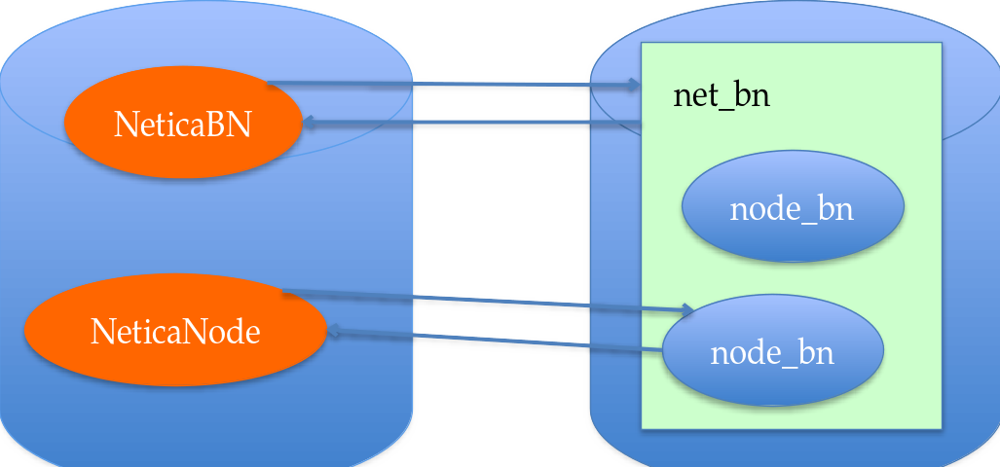

```{r setup, include=FALSE}
knitr::opts_chunk$set(echo = TRUE)
```
# RNetica and Peanut Packages

## Four Packages


1. CPTtools -- Design patterns for Conditional Probability Tables
    * Independent of other packages
2. RNetica -- Low-level R/Netica Interface
    * Needs license from Norsys
3. Peanut -- Object-oriented parameterized Bayesian Networks
    * Implementation independent
    * Uses CPTtools
4. PNetica -- RNetica implementation of Peanut protocols

https://pluto.coe.fsu.edu/RNetica

_Packages must be installed in this order!_

## RNetica License Agreements

- R:  GPL-3 (Free and open source)
- RNetica, CPTtools, Peanut, PNetica:  Artistic-2.0 (Free and open source)
- Netica.dll/libNetica.so:  Commercial (openAPI, but not open source)
    * Free Student/Demo Version
        + Limited number of nodes.
        + Limited Usage (education, evaluation of Netica)
    * Paid version (see http://www.norsys.com/ for price information).
        + Need to purchase API, not GUI verison of Netica for RNetica
        + May want GUI for network visualization.
    * Netica.dll/libNetica.so included with binary distributions by permission of Norsys
        + License key still must be purchased.

## Installation Preliminaries

You can install the packages from source or (Windows and Mac OS only)
from precompiled binaries.    

Compiling packages from source require installing the proper
compilers.  Instructions can be found at
[Windows](https://cloud.r-project.org/bin/windows/Rtools/) or [Mac
OS](https://mac.r-project.org/tools/). 

The following packages are used by the PNetica software and should be installed (usual CRAN mirror) before starting.

```{r dependencies, eval=FALSE}
install.packages(c("R.utils","futile.logger","devtools",
                   "shiny","shinyjs", "ggplot2", "lattice", "devtools"),
                 repos="https://cloud.r-project.org/")
```
You can also install these packages using the RStudio `Tools > Install Packages` menu item. 

## Installation Method 1 -- Precompiled tarballs

This method is available only for Windows and Mac OS.


Download the compiles packages (`.zip` files for Windows, `.tgz` files for MacOS) from https://pluto.coe.fsu.edu/RNetica  (follow the links there for the latest version).  Make sure to grab all four tarballs.

Windows :
[CPTtools_0.7-2.zip](https://pluto.coe.fsu.edu/RNetica/CPTtools_0.7-2.zip) 
[RNetica_0.8-4.zip](https://pluto.coe.fsu.edu/RNetica/RNetica_0.8-4.zip) 
[Peanut_0.8-4.zip](https://pluto.coe.fsu.edu/RNetica/Peanut_0.8-4.zip)  
[PNetica_0.8-5.zip](https://pluto.coe.fsu.edu/RNetica/PNetica_0.8-5.zip)  

MacOS:
[CPTtools_0.7-2.tgz](https://pluto.coe.fsu.edu/RNetica/CPTtools_0.7-2.tgz) 
[RNetica_0.8-4.tgz](https://pluto.coe.fsu.edu/RNetica/RNetica_0.8-4.tgz)
[Peanut_0.8-4.tgz](https://pluto.coe.fsu.edu/RNetica/Peanut_0.8-4.tgz)
[PNetica_0.8-5.tgz](https://pluto.coe.fsu.edu/RNetica/PNetica_0.8-5.tgz)

## install.packages and R CMD INSTALLATION 


To install the packages using R Studio, select the "Tools > Install Packages" menu item, then select "Local Package Archive" from the first "Install from" drop down.  

You can also use this command:

```{r install local file, eval=FALSE}
install.packages(file.choose())
```

Finally, if you open a terminal window, you can run the command `R CMD INSTALL <packagefile>` to install the package.

_Packages must be installed in order!_

## Installation Method II -- Source and Github

All of the packages are currently available on [Github](https://github.com/ralmond).  

Installing RNetica from github requires the appropriate compilers (Rtools or Xcode) installed on your system.

```{r github installation, eval=FALSE}
#uncomment first line if needed.
#install.packages("devtools",repos="https://cloud.r-project.org")
library(devtools)
install_github("ralmond/CPTtools")
install_github("ralmond/RNetica")
install_github("ralmond/Peanut")
install_github("ralmond/PNetica")
```

## Netica Session:  R and Netica Memory




- R and Netica have two different workspaces (memory heaps)
- R workspace is saved and restored automatically when you quick and restart R.
- Netica heap must be reconnected manually.

## Netica Session Object


+ Provides link to Netica Memory Space
+ Is a container for all `NeticaNetwork` objects
+ Must be reconnected every R session, using `startSession()`

* When you purchase a license, Norsys will send you a license key.
  Something that looks like:
  
  “+Course/FloridaSU/Ex15-05-30,120,310/XXXXX” 
  
  (Where I’ve obscured the last 5 security digits) 

To install the license key, start R in your project directory and type:

```{r saveLicense, eval=FALSE}
NeticaLicenseKey <- “+Course/FloridaSU/Ex15-05-30,120,310/XXXXX”
q(“yes”)
```
Can also put first line in file in your home directory and run
`source("~/NeticaLicense.R")` every time you run RNetica.

## Starting RNetica

After you load RNetica you need to start the session.  This is when you pass the license key.

```{r Start with license, eval=FALSE}
library(RNetica)
sess <- NeticaSession(LicenseKey=NeticaLicenseKey)
startSession(sess)
```

```{r Start without license, eval=TRUE}
library(RNetica)
sess <- NeticaSession()
startSession(sess)
```
+ If license key is not installed, then you will get the
limited/student mode.  Most of these examples will run. 

## When to use the session object.

* When starting/restarting Netica
* When creating a network, or reading one from a file.
* When searching for networks.
* Certain global properties

`NeticaNetwork` objects have a `$session` proprty which points back to
the session. 

`NeticaNode` objects have a `$net` property which points back to the
network (which points to the session). 

## Active and Inactive Pointers


+ When RNetica creates/finds a Netica object it creates a corresponding R object
+ R NeticaBN objects live in the NeticaSession object.  
    - R NeticaNode objects live in the NeticaBN.
+ If the pointer gets broken (saving & restarting R, deleting the network/node) then the R object becomes inactive.
+ The function `is.active()` tests to see if the node/net/session is active

## A simple example

A subset of the ACED (http://ecd.ralmond.net/ecdwiki/ACED/ACED/) network.


## Mini-ACED EM Fragments

All ACED tasks were scored correct/incorrect

Each evidence model is represented by a fragment consisting of observables with _stub_ edges indicating where it should be _adjoined_ with the network.


## Task to EM map

Need a table to tell us which EM to use with which task

```{r EM mapping}
## Read in task->evidence model mapping
EMtable <- read.csv("miniACED/MiniACEDEMTable.csv",row.names=1,
                    as.is=2) #Keep EM names as strings
EMtable
```

# Scoring Script

## Preliminaries

The following script assumes that the data files it needs are in the folder `miniACED` and that this folder is in the same directory as this `Rmd` file.

Don’t forget to `setwd()` to the `miniACED` folder (as it needs to find its networks).


```{r Start Netica}
## Scoring Script
## Preliminaries
library(RNetica)

sess <- NeticaSession()
startSession(sess)
```

## Read in the Network.

```{r read networks}
## Read in network -- Do this every time R is restarted
profModel <- ReadNetworks("../Nets/miniACEDPnet.dne",session = sess)
## If profModels already exists could also use

## Reconnect nodes -- Do this every time R is restarted
allNodes <- NetworkAllNodes(profModel)
sgp <- allNodes$SolveGeometricProblems
sgp
```

## Aside 1 -- Node Sets

Node sets can be viewed as either 
  
  A. a set of labels assigned to each node.
  
  B. a set of nodes which have a particular label.

In RNetica, these are very useful as they define collections 
of nodes that might be interesting in some way (e.g., 
Proficiency variables, Observable variable, background variables)

Node set operations yeild a list of nodes; 
iterating over that set is often very useful.

## Node Set Examples

```{r Node Sets}
## Node Sets
NetworkNodeSets(profModel)
NetworkNodesInSet(profModel,"pnodes")
```

## More Node Set Examples

```{r More Node Set Examples}
profNodes <- NetworkNodesInSet(profModel,"Proficiencies")
NodeSets(sgp)
```

Adding a node to a set.

```{r Setting node sets}
## These are all settable
NodeSets(sgp) <- c(NodeSets(sgp),"HighLevel")
NodeSets(sgp)
```


## Aside 2:  Common Net operations

Just about everything that can be done through the Netica GUI, 
can be done through the Netica API, and hence through R Netica.
[In practice, the API version has lagged the GUI version, and my 
RNetica release lag Norsys's API updates.]  Many more examples are in the RNetica help.  

```{r RNetica operations}
## Querying Nodes
NodeStates(sgp)   #List states
NodeParents(sgp)  #List parents
```
## More RNetica Queries

```{r More RNetica Operations}
NodeLevels(sgp)   #List numeric values associated with states
NodeProbs(sgp) # Conditional Probability Table (as array)
## These are all settable (can be used on RHS of <-) for model
## construction
```

## Conditional Probability Tables (as Data Frame)

```{r CPT}
sgp[] # Conditional Probability Table (as data frame)
```

Can use `[]` operator to select rows or elements 

Can set table or (row or cell).

`CPTtools` package has tools for building tables.
```{r CPTtools, eval=FALSE}
help(package="CPTtools")
```


## Inference

Networks must be _compiled_ before they are used for inference.

```{r Inference operations}
## Inference
CompileNetwork(profModel) #Lightning bolt on GUI 
## Must do this before inference
## Recompiling an already compiled network is harmless
```

```{r Values}
## Enter Evidence by setting values for these functions
NodeValue(sgp) #View or set the value
NodeLikelihood(sgp) #Virtual evidence
```

## Beliefs (Marginal Probabilities)

```{r Beliefs}
## Query beliefs
NodeBeliefs(sgp) #Current probability (given entered evidence)
NodeExpectedValue(sgp) #If node has values, EAP
## These aren't settable
```

```{r Retracting evidence}
## Retract Evidence
RetractNodeFinding(profNodes$ExamplesGeometric)
RetractNetFindings(profModel)
```

## Example:  Enter Evidence
```{r Enter Evidence}
## Enter Evidence
NodeFinding(profNodes$CommonRatio) <- "Medium"
## Enter Evidence "Not Low" ("High or Medium")
NodeLikelihood(profNodes$ExamplesGeometric) <- c(1,1,0)

NodeBeliefs(sgp) #Current probability (given entered evidence)
NodeExpectedValue(sgp) #If node has values, EAP
```

## Example:  Retract Evidence
```{r Retract Evidence}
## Retract Evidence
RetractNetFindings(profModel)
```


Many more examples:  
```{r help RNetica, eval=FALSE}
help(RNetica)
```


## Back to work

Simple Scoring Example 

*Start New Student*
Copy the _proficiency model_ to make _student model_.

```{r New Student}
Fred.SM <- CopyNetworks(profModel,"Fred")
Fred.SMvars <- NetworkAllNodes(Fred.SM)
CompileNetwork(Fred.SM)
```

## Setup score history.
```{r Setup history}
prior <- NodeBeliefs(Fred.SMvars$SolveGeometricProblems)
Fred.History <- matrix(prior,1,3)
row.names(Fred.History) <- "*Baseline*"
colnames(Fred.History) <- names(prior)
Fred.History
```


## Fred does a task

Task name and data.
```{r task data}
t.name <- "tCommonRatio1a"
t.isCorrect <- "Yes"
```

Adjoin SM and EM
```{r build motif}
EMnet <- ReadNetworks(file.path("..","Nets",
     paste(EMtable[t.name,"EM"],"dne",sep=".")),
                      session = sess)
obs <- AdjoinNetwork(Fred.SM,EMnet)
names(NetworkAllNodes(Fred.SM)) 
## Fred.SM is now the Motif for the current task.
CompileNetwork(Fred.SM)
```

## Absorb Evidence

Enter finding
```{r enter finding}
NodeFinding(obs$isCorrect) <- t.isCorrect
```

Calculate statistics of interest
```{r calculate statistics}
post <- NodeBeliefs(Fred.SMvars$SolveGeometricProblems)
Fred.History <- rbind(Fred.History,new=post)
rownames(Fred.History)[nrow(Fred.History)] <- paste(t.name,t.isCorrect,sep="=")
Fred.History
```


## Cleanup 

Network and Observable no longer needed, so absorb it:
```{r Absorb evidence nodes}
DeleteNetwork(EMnet) ## Delete EM
try(AbsorbNodes(obs))
## Currently, there is a Netica bug with Absorb Nodes, we will
## leave this node in place, as that is mostly harmless.
```
## 2nd Task

Write a script for scoring the second task.  
This time Fred attempts the task `tCommonRatio2a` and gets it incorrect.


```{r exercise, eval=FALSE}
### Fred does another task
t.name <- "tCommonRatio2a"
t.isCorrect <- "No"

## Load Evidence Model and adjoin

## Recompile

## Add Evidence

## Check Finding and add to history

## Clean up

```


## Answer for 2nd Task

```{r solution}
### Fred does another task
t.name <- "tCommonRatio2a"
t.isCorrect <- "No"

EMnet <- ReadNetworks(file.path("..","Nets",
                      paste(EMtable[t.name,"EM"],"dne", 
                            sep=".")),
                      session=sess)
obs <- AdjoinNetwork(Fred.SM,EMnet)
#NodeVisPos(obs$isCorrect) <- EMtable[t.name,c("X","Y")]
## Fred.SM is now the Motif for the current task.
CompileNetwork(Fred.SM)

NodeFinding(obs[[1]]) <- t.isCorrect
post <- NodeBeliefs(Fred.SMvars$SolveGeometricProblems)
Fred.History <- rbind(Fred.History,new=post)
rownames(Fred.History)[nrow(Fred.History)] <- 
      paste(t.name,t.isCorrect,sep="=")
Fred.History

## Cleanup:  Delete EM and Absorb observables
DeleteNetwork(EMnet) ## Delete EM
AbsorbNodes(obs)
```


## Fred does another task

```{r new data}
t.name <- "tCommonRatio2a"
t.isCorrect <- "No"
```

```{r new EM}
EMnet <- ReadNetworks(file.path("..","Nets",
                paste(EMtable[t.name,"EM"],"dne",sep=".")),
                session=sess)
obs <- AdjoinNetwork(Fred.SM,EMnet)
(NetworkAllNodes(Fred.SM)) ## Fred.SM is now the Motif for the current task.
CompileNetwork(Fred.SM)
```

## Task 2 continued

```{r enter new finding}
NodeFinding(obs[[1]]) <- t.isCorrect
post <- NodeBeliefs(Fred.SMvars$SolveGeometricProblems)
Fred.History <- rbind(Fred.History,new=post)
rownames(Fred.History)[nrow(Fred.History)] <- paste(t.name,t.isCorrect,sep="=")
Fred.History
```


Cleanup:  Delete EM and Absorb observables
```{r cleanup on task 2}
DeleteNetwork(EMnet) ## Delete EM
try(AbsorbNodes(obs))
## Currently, there is a Netica bug with Absorb Nodes, we will leave
##this the node in place as that is mostly harmless.
```


## Fred logs out
Save network to a file.
```{r Save Fred}
WriteNetworks(Fred.SM,"FredSM.dne")
DeleteNetwork(Fred.SM)
is.active(Fred.SM)  ## No longer active in Netica space
```

Fred logs back in
```{r Restor Fred}
Fred.SM <- ReadNetworks("FredSM.dne",session=sess)
is.active(Fred.SM)
```


# Score an entire set of cases.

## Read in the scores.

```{r miniACED data}
miniACED.data <- read.csv("../Nets/miniACED-Geometric.csv",row.names=1)
head(miniACED.data)
```
Some meta-data
```{r metadata}
## Mark columns of table corresponding to tasks
first.task <- 9
last.task <- ncol(miniACED.data)
## Code key for numeric values
t.vals <- c("No","Yes")

## Pick a student, we might normally iterate over this.
Student.row <- 1
```

## Setup for student in sample

Create Student Model from Proficiency Model
```{r setup student}
Student.SM <- CopyNetworks(profModel,"Student")
Student.SMvars <- NetworkAllNodes(Student.SM)
CompileNetwork(Student.SM)
```

Initialize history list
```{r setup history}
prior <- NodeBeliefs(Student.SMvars$SolveGeometricProblems)
Student.History <- matrix(prior,1,3)
row.names(Student.History) <- "*Baseline*"
colnames(Student.History) <- names(prior)
```

## Now loop over tasks

```{r Scoreit}
for (itask in first.task:last.task) {
  
  ## Look up the EM for the task, and adjoin it.
  tid <- names(miniACED.data)[itask]
  EMnet <- ReadNetworks(file.path("..","Nets",
                        paste(EMtable[tid,"EM"],"dne",sep=".")),
                        session=sess)
  obs <- AdjoinNetwork(Student.SM,EMnet)
  CompileNetwork(Student.SM)

  ## Add the evidence
  t.val <- t.vals[miniACED.data[Student.row,itask]] #Decode integer
  NodeFinding(obs[[1]]) <- t.val
  
  ## Update the history
  post <- NodeBeliefs(Student.SMvars$SolveGeometricProblems)
  Student.History <- rbind(Student.History,new=post)
  rownames(Student.History)[nrow(Student.History)] <- paste(tid,t.val,sep="=")

  ## Cleanup, Delete EM and Absob Observables
  DeleteNetwork(EMnet)
  try(AbsorbNodes(obs)) # Still broken
}
```

## Now look at the scoring history.
```{r history}
Student.History
```

# Weight of Evidence
## Weight of Evidence

Good \(1985\)

_H_ is binary hypothesis\, e\.g\.\, _Proficiency_ > _Medium_

_E_ is evidence for hypothesis

Weight of Evidence \(WOE\) is

$$ W(H:E) = \log \frac{P(E|H)}{P(E|\overline{H})} =
\log  \frac{P(H|E)}{P(\overline{H}|E)} -
\log  \frac{P(H)}{P(\overline{H})} $$

## Conditional Weight of Evidence

$$ W(H: E_2 | E_1) = \log  \frac{P(E_2|H,E_1)}{P(E_2|\overline{H},E_1)}
$$
Additive properties

$$ W(H: E_1, E2) = W(H: E_1) + W(H: E_2|E_1) $$

Order senstive (evidence seen earlier is worth more)

WOE Balance Sheet:

## Now examine scoring history

```{r woe balance sheet}
woeBal(Student.History,c("High","Medium"),"Low",
       title=paste("Evidence Balance Sheet for ",
                   rownames(miniACED.data)[Student.row]))
```

## For More information

```{r More Help, eval = FALSE}
help(RNetica)
help(package="RNetica")
help(CPTtools)
help(package="CPTtools")
```
